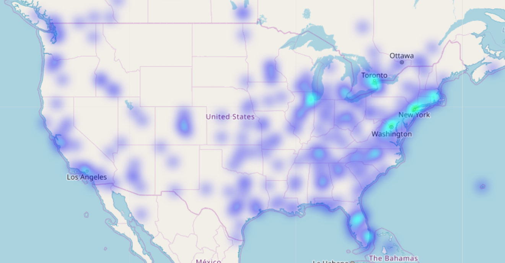
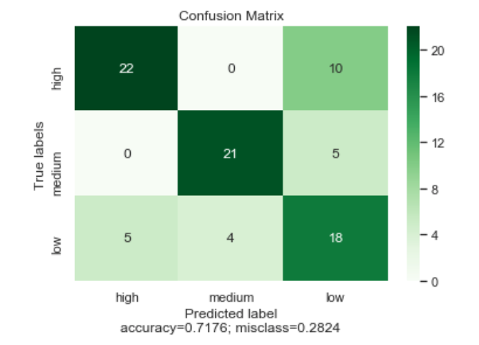
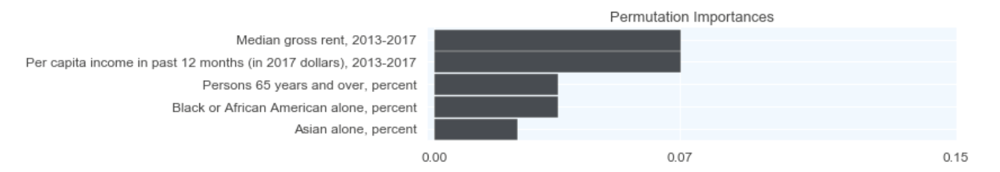
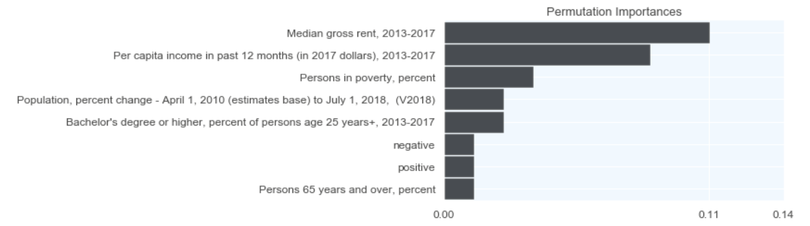
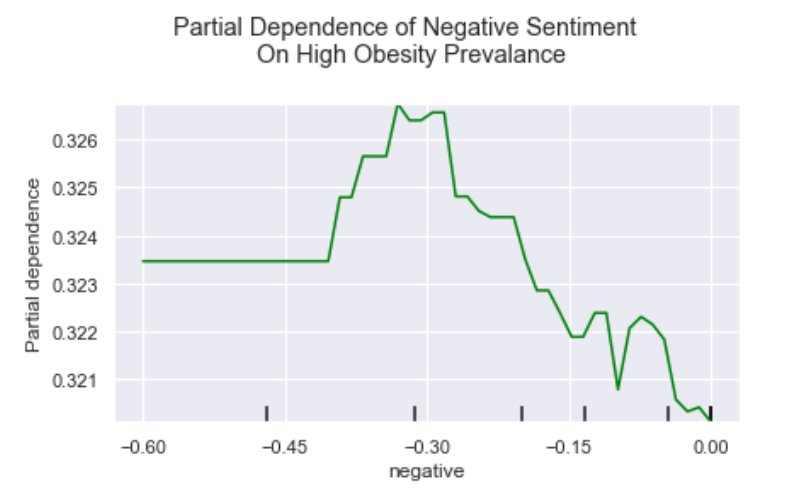
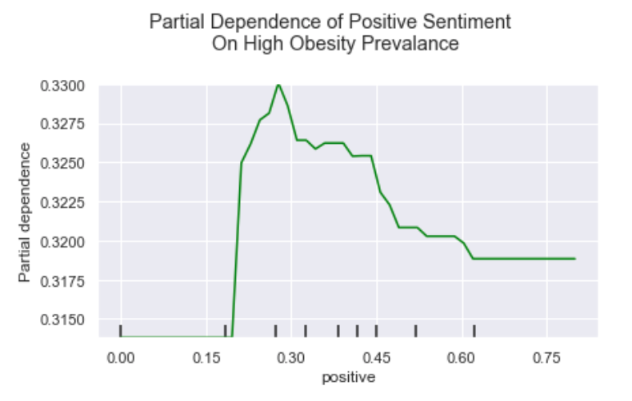
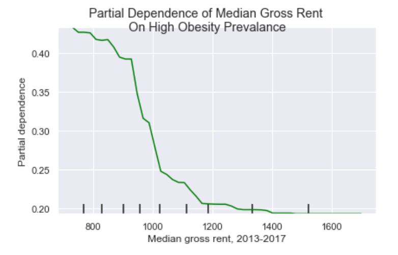
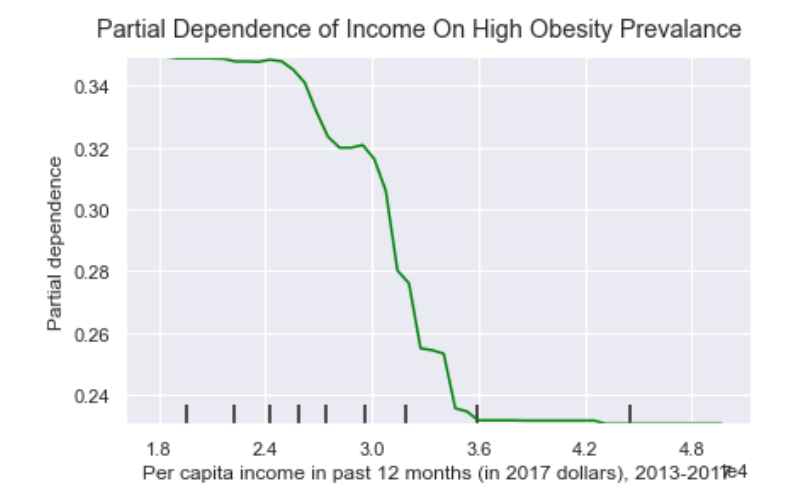

# Analyzing Sentiment of Fad Diet Tweets using Natural Language Processing and Predicting Health Outcomes with Machine Learning Techniques
Vinh Tran

### Links to Presentation
[Keynote](https://drive.google.com/file/d/1eELvOFhvU7BpXIzDhOLDOIlTbJy5KrYq/view?usp=sharing),
[PDF](https://drive.google.com/file/d/1RrDwgiRb_zyAFHyjcw0eih1gRjDUZj0p/view?usp=sharing)

# Table of Contents
- [Background](#Background)
- [Data Sources](#Data-Sources)
- [Pipeline](#Pipeline)
- [Modeling](#Modeling)
- [Results](#Results)
- [Conclusions and Next Steps](#Conclusions)
- [Tools Used](#Tools-Used)
- [References](#References)

# Background

In 2018, the diet and weight loss market in the US continued to grow to roughly $72 billion dollars [(1)](https://www.businesswire.com/news/home/20190225005455/en/72-Billion-Weight-Loss-Diet-Control-Market). This is in light of constant changes in consumer tastes, preferences and dietary goals (i.e., shift from being “skinny” to being “healthy” and “strong”). Fad diets capitalize on this market by promising improved health usually by way of weight-loss. Other hallmarks of fad diets include: promoting/restricting certain foods or food groups, promising various improved health-outcomes (quickly), being hard to sustain, and only being anecdotally effective. Recent popular fad diets include the Keto diet and the Paleo diet.

One major factor why fad diets are popular today is the pursuit of weight-loss because of the current obesity epidemic in the US [(2)](https://www.hsph.harvard.edu/nutritionsource/an-epidemic-of-obesity/). Almost 40% of US adults are obese, translating to roughly 93.3 million adults in 2015-2016. 66%  are overweight. This is not only a public health issue but an economic one. According to the CDC, “The estimated annual medical cost of obesity in the United States was $147 billion in 2008 US dollars; the medical cost for people who have obesity was $1,429 higher than those of normal weight. “ [(3)](https://www.cdc.gov/obesity/data/adult.html).

Furthermore, obesity has been shown to have a network effect [(4)](https://www.nejm.org/doi/full/10.1056/NEJMsa066082). In a widely-cited study by Christakis, et. al. at Harvard, the chances of becoming obese increased by 57% if he or she had a friend who became obese in a given interval. Therefore, it is worth exploring the social aspect of fad diets as it relates to obesity within a network like a city.

### Definition of Obesity

| BMI (kg/m^2) | Classification |
|:---:|:---:|
| < 18.5 | underweight |
| 18.5 up to 25.0 | normal weight |
| 25.0 up to 30.0 | overweight |
| 30.0 up to 35.0 | class I obesity |
| 35.0 up to 40.0 | class II obesity |
| >= 40.0 | class III obesity |


In this project, tweets about fad diets are used to understand the relationship to obesity prevalence rates in US cities.


# Data Sources:
(1) Twitter. Tweets were collected with the “firehose” method, which collects 1% of tweets as they stream in, using Tweepy and calling on Twitter’s API for one month. Tweets were restricted to English language tweets and further filtered on mentions of the following fad diets: Keto, Gluten Free, Atkins, Paleo, and Whole30. The diets were selected through a search of the most current popular fad diets as of May 2019. For more EDA see my [first capstone](https://github.com/vinhttran/fad_diets). Keto was the most tweeted about diet.

### Popularity of Fad Diets


Tweets were clustered around major cities confirming that tweets can be analyzed at the city level.
### Heatmap


### Overview of fad diets [5](mayoclinic.org)

|Diet|Description|
|:---:|:---:|
|Keto| Low-carb, high-fat. The idea is to put your body into a metabolic state called ketosis. |
|Gluten Free| Exclude the protein gluten found in many grains. In non celiac or wheat-sensitive persons its purported benefits are improved health, weight loss and increased energy.|
|Atkins| Low-carb. Promoted by the physician Dr. Robert C. Atkins, who wrote a best-selling book about it in 1972.|
|Paleo| Also known as the caveman diet. Based on foods similar to what might have been eaten during the Paleolithic era with a diet high in lean meats, fish, fruits, vegetables, nuts and seeds. Limits dairy products, legumes and grains.|
|Whole30|For 30 days, no sugar, alcohol, grains, legumes, dairy or treats in general are allowed Moderate amounts of meat, seafood and eggs; vegetables aplenty; some fruit; and natural fats such as nuts and avocado.|


(2) [CDC 500 Cities](https://www.cdc.gov/500cities/index.htm). This project provides city-level chronic disease outcomes comes from the CDC 500 Cities Project. Of interest are obesity prevalence rates for the largest 500 cities in the US to be used as the target.

(3) Census. Demographic information for cities were obtained from the American Community Survey 2017 release which included data on population, age and sex, race and ethnicity, housing, living arrangements, computer use, education, disability, workforce and businesses.


# Pipeline


Tweets were filtered as described above. A sentiment score was calculated for each tweet using TextBlob after preprocessing, which included removal of URLs, smileys, mentions and emojis. For more EDA see my [second capstone](https://github.com/vinhttran/fad_diets_ml) which found the following broad topics in the tweets using Natural Language Processing and Latent Dirichlet Allocation:


These were the most common words in the tweets:


Twitter data was then mapped to the closest major city using the tagged geolocation and merged by city and state to CDC 500 Cities data. Obesity prevalence rates were quantile-based discretized to "low", "medium", and "high" prior to the merge. These data were then merged to Census data, again using city and state.


Each variable was inspected. In the feature matrix, variables highly correlated variables to each other were removed. The baseline feature matrix consisted of only census demographic variables. The full feature matrix includes positive and negative sentiment scores. The target variable is the categorical obesity rates.


# Modeling
Since the dependent variable is categorical, classification models were used to predict obesity prevalence: logistic regression, random forest, and gradient boosting. Using accuracy as the performance metric (the number of correct predictions divided by total predictions), Random Forest performed the best. In the baseline model the accuracy score was 0.68. With the full feature matrix, including tweet sentiment, the accuracy score improved by 6% to .74. GridSearch was used to find the optimal hyperparameters.

|Random Forest|Accuracy|Hyperparameters|
|:---:|:---:|:---:|
|Baseline| 0.68 | n_estimators = 100, max_features=3, max_depth = 90, min_samples_split = 8, min_samples_leaf=4|
|Full| 0.74 | n_estimators = 100, max_features=3, max_depth = 90, min_samples_split = 8, min_samples_leaf=4|


# Results

### Confusion Matrix


The model was better at predicting high and medium obesity compared to low obesity prevalence.

### Permutation Importances
Permutation Importance was used to determine the most important features in the model. This method was used because it is a more reliable method than the built-in feature importance method. With permutation importance, a baseline accuracy is recorded by passing a validation set. Then features are permuted and accuracy score is re-calculated. The importance of that feature is the difference between the baseline and the drop in overall accuracy or R2 caused by permuting the column.[(7)](https://eli5.readthedocs.io/en/latest/blackbox/permutation_importance.html)


Baseline Permutation Importances: Per capita income," "Asian alone," "mean travel time to work," and "Hispanic" are the top features based on permutation importance.



Full Permutation Importances: Positive and negative tweet scores are the 5th and 7th most important features in the model.



### Partial Dependence Plots
Partial dependence plots show the dependence between a variable and the obesity prevalence. Obesity prevalence was categorized into high and medium+low for this purpose because it is more important to see the impact on cities with high obesity prevalence.

Highly positive and highly negative tweets are associated with higher obesity prevalence. High obesity rates are less dependent on slightly negative and slightly positive tweets.





Looking at the two highest permutation importance features, High obesity rates are dependent on Median Gross Rent from $800 to $900 a month after which the dependence decreases rapidly.



High obesity rates are dependent on per capita income (mean income of living group) from around 19k to 30k a month after which the dependence decreases rapidly.




# Conclusion
Cities where tweets are more highly positive and negative are important features in predicting high obesity prevalence rates. This finding shows that the sentiment with which people are talking about fad diets within their network is associated to obesity. The random forest model yielded the highest accuracy score. From a public health perspective, tweet sentiment can be monitored and used as a cost-effective up-to-the-minute preliminary indicator of high obesity prevalence for cities. From a marketing perspective, this information can point to drivers of highly negative or positive tweets about a diet with additional research.

There are several limitations. Aside from the limitations of twitter data, there are too many fad diets to filter on and only the most popular ones were used. Fads, by nature, are fleeting and no doubt different fad diets will pop up within the next year than analyzed here. Twitter also recently removed their precise location tagging [(8)](https://www.niemanlab.org/2019/06/twitter-is-turning-off-location-data-on-tweets-a-small-win-for-privacy-but-a-small-loss-for-journalists-and-researchers/).

The CDC dataset is limited to the 500 largest cities which represent ~1/3 of the population. Thus, rural areas are not represented in this data.

Future research should link BMI scores to each tweet to unveil the true relationship between tweet sentiment and obesity. It is likely persons with obesity have more extreme emotions related to fad diets, leading to more positive and negative tweets. Also, examining if these findings hold outside the US will provide more information in the global market since fad diets are a worldwide phenomenon especially with a rising middle class. Additionally, a dashboard can be used capture tweets in real-time as part of a model that continually predict obesity rates with the latest data. Focus on rural areas.


# References
1. https://www.businesswire.com/news/home/20190225005455/en/72-Billion-Weight-Loss-Diet-Control-Market
2. https://www.hsph.harvard.edu/nutritionsource/an-epidemic-of-obesity/
3. https://www.cdc.gov/obesity/data/adult.html
4. https://www.nejm.org/doi/full/10.1056/NEJMsa066082
5. https://www.mayoclinic.org
6. https://www.cdc.gov/500cities/index.htm)
7. https://eli5.readthedocs.io/en/latest/blackbox/permutation_importance.html
8. https://www.niemanlab.org/2019/06/twitter-is-turning-off-location-data-on-tweets-a-small-win-for-privacy-but-a-small-loss-for-journalists-and-researchers/)

# Tools Used:
Python (Pandas, Numpy)
Natural Language Processing (TextBlob)
Twitter API


<a href="#Analyzing-Fad-Diet-Tweets">Back to top</a>

```python

```
